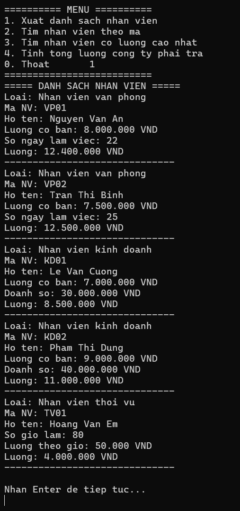
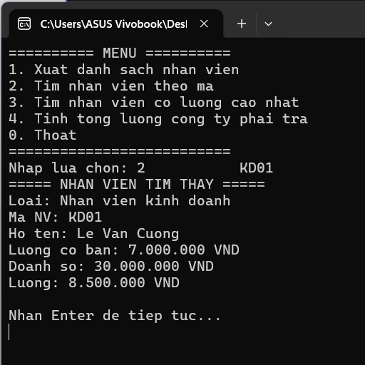
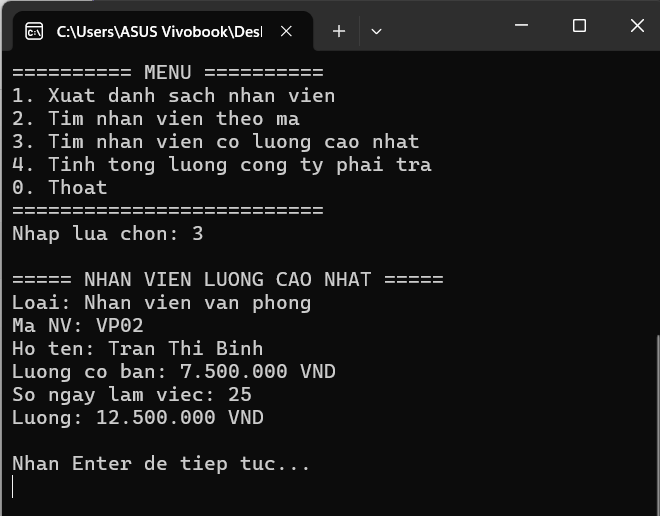
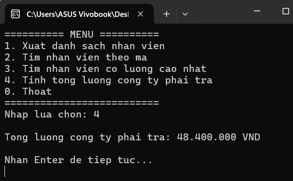

# Bài tập lớp - Quản lý nhân viên

## 1. Mô tả

Xây dựng chương trình Console C# quản lý nhân viên, áp dụng các kiến thức về lập trình hướng đối tượng gồm:

- Class
- Property
- Constructor
- Encapsulation
- Kế thừa
- Đa hình

Chương trình quản lý các loại nhân viên:

- Nhân viên văn phòng
- Nhân viên kinh doanh
- Nhân viên thời vụ

## 2. Chức năng

1. Xuất danh sách nhân viên.

2. Tìm nhân viên theo mã.

3. Tìm nhân viên có lương cao nhất.

4. Tính tổng lương công ty phải trả.

## 3. Áp dụng đa hình

Chương trình sử dụng:

```csharp
List<NhanVien> danhSach = new List<NhanVien>();