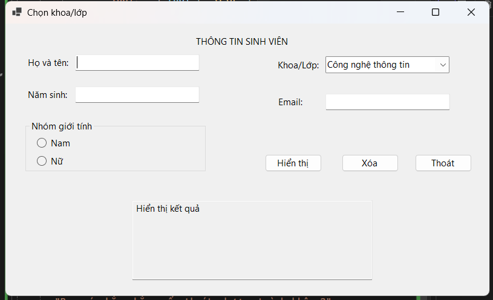
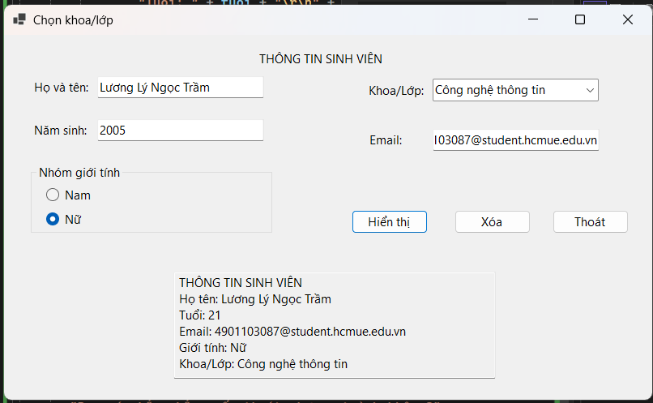
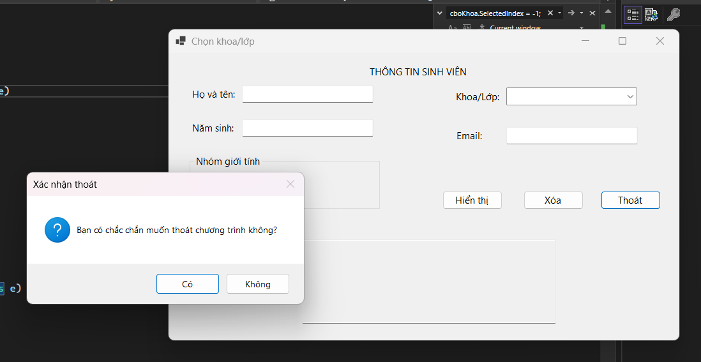

# LAB 01

## Mô tả
Xây dựng ứng dụng Windows Forms cho phép nhập và hiển thị thông tin cá nhân của sinh viên.

## Chức năng
- Nhập họ tên, năm sinh, email.
- Chọn giới tính.
- Chọn khoa/lớp.
- Kiểm tra dữ liệu đầu vào.
- Hiển thị thông tin sinh viên.
- Xóa dữ liệu đã nhập.
- Xác nhận trước khi thoát chương trình.
## Hình ảnh kết quả

### Giao diện chương trình

### Kết quả chạy chương trình

### Xác nhận thoát

