# LAB 03 - QUẢN LÝ SINH VIÊN BẰNG C#

## Học phần: COMP1019 - Lập trình trên Windows

### Buổi 3 - C# và lập trình hướng đối tượng

---

## 1. Menu chương trình

===== QUẢN LÝ SINH VIÊN =====
1. Thêm sinh viên
2. Xuất danh sách
3. Tìm sinh viên theo mã
4. Tìm sinh viên theo tên
5. Sửa điểm trung bình
6. Xóa sinh viên
7. Sắp xếp theo điểm giảm dần
8. Lọc sinh viên đạt
0. Thoát

# 2. Các chức năng của chương trình

## 2.1. Thêm sinh viên

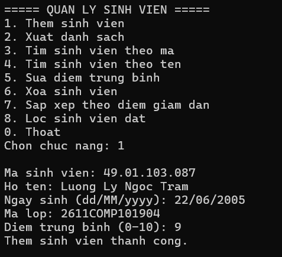

## 2.2. Xuất danh sách sinh viên

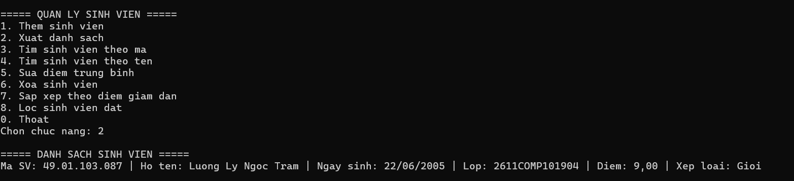

## 2.3. Tìm sinh viên theo mã

### Trường hợp tìm thấy sinh viên

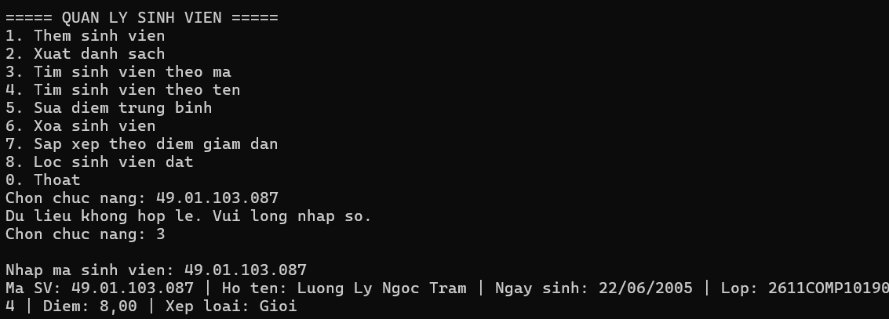

### Trường hợp không tìm thấy sinh viên

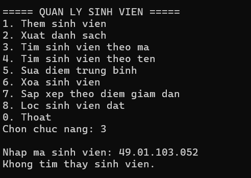

## 2.4. Tìm sinh viên theo tên

### Trường hợp tìm thấy sinh viên

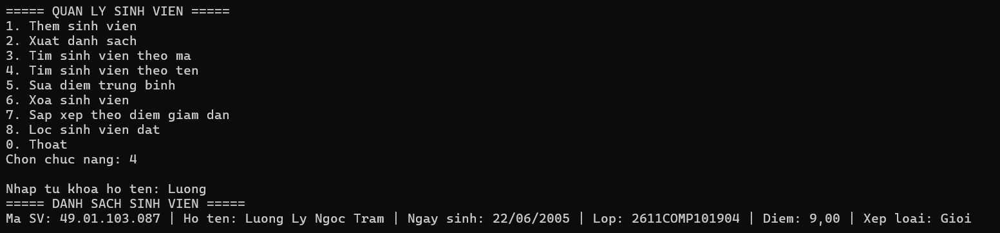

### Trường hợp không tìm thấy sinh viên

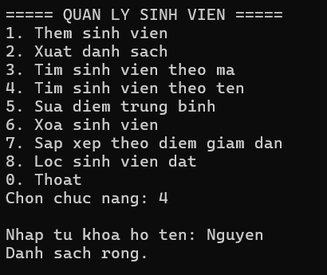

## 2.5. Sửa điểm trung bình

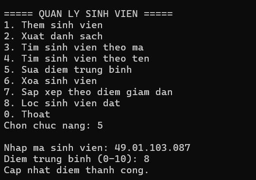

## 2.6. Xóa sinh viên

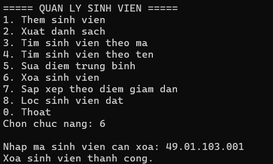

## 2.7. Sắp xếp sinh viên theo điểm giảm dần

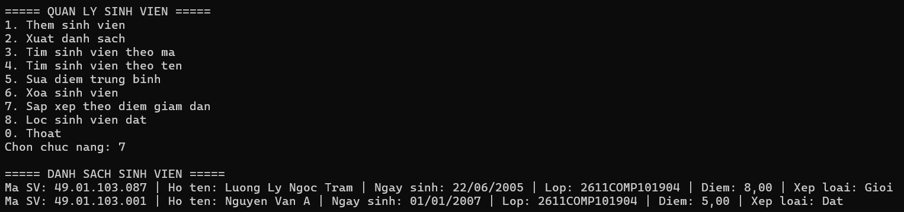

## 2.8. Lọc sinh viên đạt

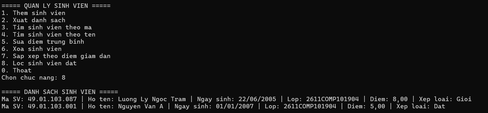

## 2.9. Thoát chương trình

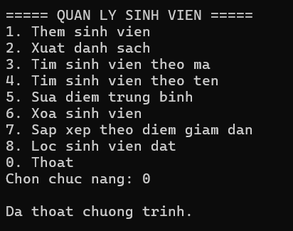

# 3. Kiểm tra dữ liệu

## 3.1. Kiểm tra chức năng không hợp lệ

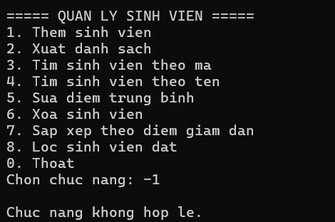

## 3.2. Kiểm tra mã sinh viên đã tồn tại

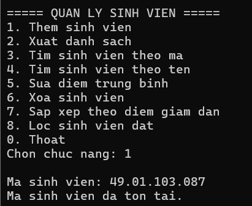
