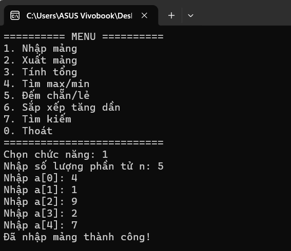
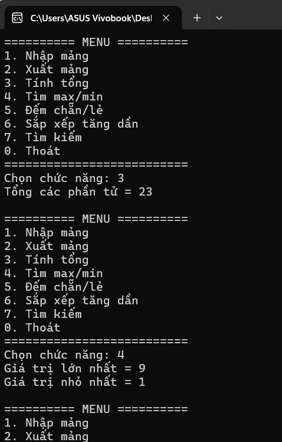
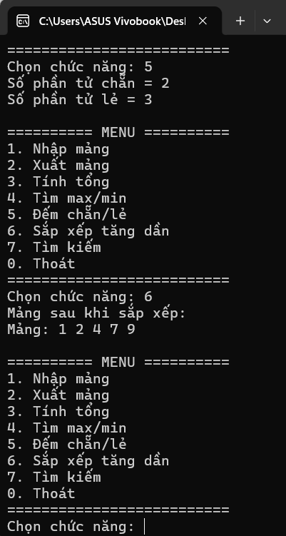
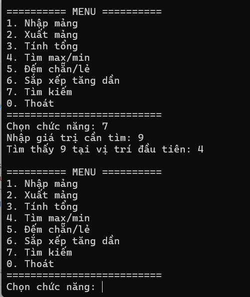

# LAB 02 - QUẢN LÝ MẢNG SỐ NGUYÊN

## 1. Mô tả

Chương trình C# Console thực hiện các chức năng trên một mảng số nguyên.

## 2. Các chức năng

- Nhập mảng
- Xuất mảng
- Tính tổng các phần tử
- Tìm giá trị lớn nhất và nhỏ nhất
- Đếm số phần tử chẵn và lẻ
- Sắp xếp mảng tăng dần
- Tìm kiếm một giá trị trong mảng
- Thoát chương trình

## 3. Ngôn ngữ và công cụ

- Ngôn ngữ: C#
- Môi trường: Visual Studio
- Loại chương trình: Console App

## 4. Kết quả chạy chương trình

### Giao diện menu

### Tính tổng, tìm max/min

### Đếm chẵn/lẻ và sắp xếp

### Tìm kiếm

## 5. Kết luận

Chương trình thực hiện đầy đủ các chức năng được yêu cầu trong bài Lab 2.